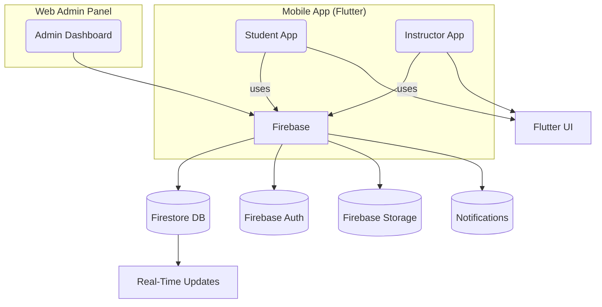

# 🚘 Driving School Management System

> A mobile-first platform for driving school operations — enabling real-time tracking, instructor management, and student learning flow. Built with **Flutter** and powered by **Firebase**, this app simplifies scheduling, training, and fee tracking for both students and instructors.

---

## 📚 Contents

- [✨ Features](#-features)
- [🏗️ Architecture](#️-architecture)
- [⚡ Quick Start](#-quick-start)
- [🌐 Tech Stack](#-tech-stack)
- [🔐 Environment Variables](#-environment-variables)
- [📜 License](#-license)

---

## ✨ Features

| Module                    | Description                                                                 |
|---------------------------|-----------------------------------------------------------------------------|
| 👨‍🏫 Instructor App         | View schedule, student attendance, progress, and confirm sessions.          |
| 🎓 Student App            | Book classes, track performance, get driving test reminders.                |
| 🛠️ Admin Panel (Web)       | Manage instructors, payments, student progress, and calendar integrations.   |
| 💳 Payments Integration    | Fee tracking and in-app payment capabilities.                               |
| 🗺️ Google Maps Integration | Location tracking and finding nearby instructors for students.              |
| 🔔 Notifications           | Firebase push notifications for class reminders and admin messages.        |
| 🧾 Progress Tracker        | Real-time performance dashboard with feedback and goals.                    |

---

## 🏗️ Architecture



---

## ⚡ Quick Start

```
# 1) Clone the repository
git clone https://github.com/Dumidu1212/driving_school_management_system.git
cd cf_sarasavi_app

# 2) Install Flutter dependencies
flutter pub get

# 3) Create a .env file and add your Firebase config
touch .env
# Paste your Firebase keys and app-specific settings

# 4) Run the app (choose one)
flutter run             # Default device
flutter run -d chrome   # For web testing
flutter run -d android  # For Android emulator
```

---

## 🌐 Tech Stack

| Layer         | Technology                 |
| ------------- | -------------------------- |
| Frontend      | Flutter (Dart)             |
| Backend       | Firebase (Firestore, Auth) |
| Maps          | Google Maps API            |
| Payments      | In-App Purchase (TBD)      |
| Notifications | Firebase Cloud Messaging   |

---

## 🔐 Environment Variables

  Create a .env file in the root directory and include:
  
```
FIREBASE_API_KEY=your-api-key
FIREBASE_PROJECT_ID=your-project-id
FIREBASE_AUTH_DOMAIN=your-auth-domain
GOOGLE_MAPS_API_KEY=your-maps-api-key
```

---

## 📜 License
  MIT © Dumindu Rajapaksha
